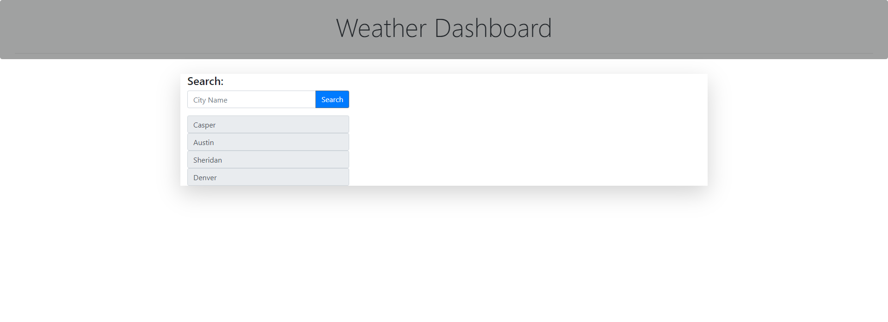

# 06 Server-Side APIs: Weather Dashboard

## My Task

My task for this assignment was to use an openWeather API to properly fetch weather data for the current day, and the next 5 days and return it to a user based upon which city they input. It also needed to save their search history to a list, and from that list the user could click a city and it would display that cities data.

## Challenges and Solutions

One of the very first challenges I faced was getting the API data to return what I needed from it. I had to use 3 different API's. One for the citys current weather, one for the citys future weather, and one for the UV index. It was tough trying to create the functions, and the function calls in the correct place and returning the correct data, But I was able to figure it out.

The next major challenge was getting the history list to creat clickable buttons, and correctly running the functions to display all the needed data.

I also had to create one more API call for the weather icons, and correctly concatenate those icons into the appended areas.

## Links
[Live Webpage](https://mli2950.github.io/Homework6-Weather-API/) 
[My Repository](https://github.com/mli2950/Homework6-Weather-API)

## Mock-Up

The following image shows the web application's appearance and functionality:

.png)

